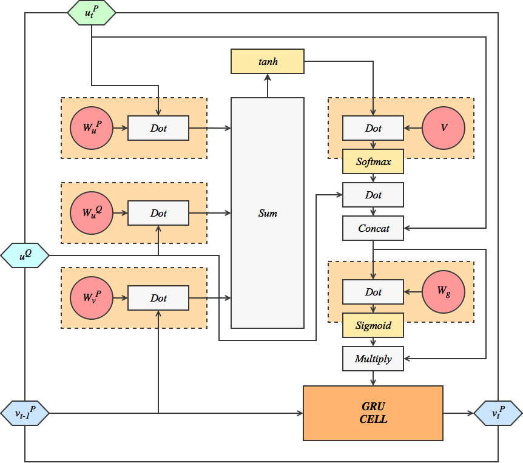
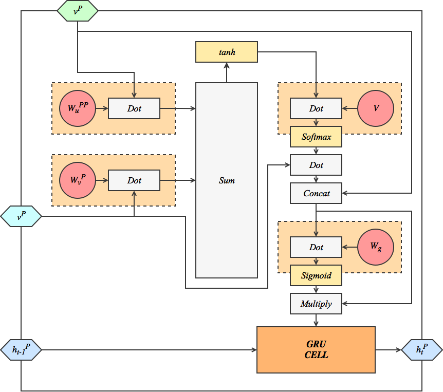
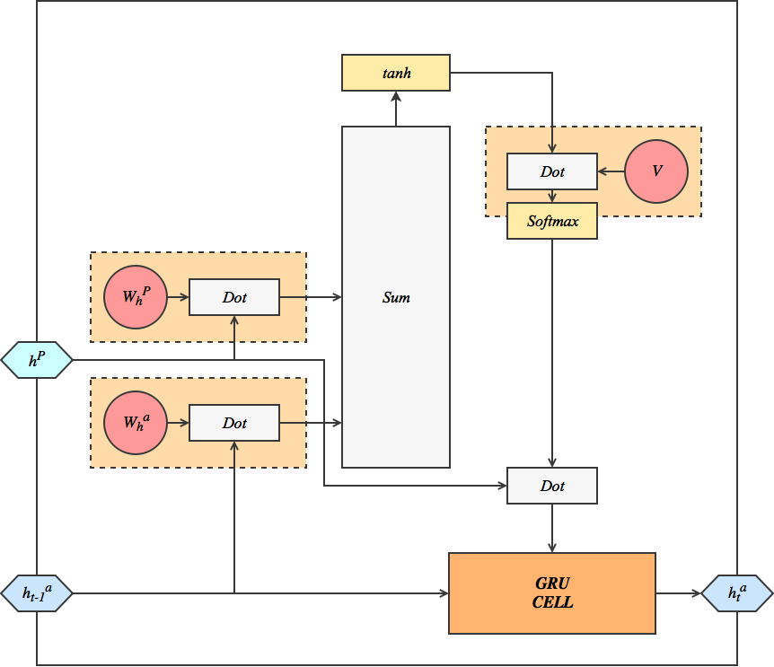

By [Martin Mirakyan](https://github.com/MartinXPN), [Karen Hambardzumyan](https://github.com/mahnerak) and
 [Hrant Khachatrian](https://github.com/Hrant-Khachatrian).

In this post we describe our attempt to re-implement a neural architecture for automated question answering called R-Net, developed by the Natural Language Computing Group of Microsoft Research Asia. This architecture demonstrates the best performance among single models (not ensembles) on The Stanford Question Answering Dataset (as of August 22, 2017). MSR researchers released a technical report describing the model but did not release the code. We tried to implement the architecture in Keras framework and reproduce their results. This post describes the model and the challenges we faced while implementing it.

<!--more-->

## Contents
{:.no_toc}
* TOC
{:toc}

## Problem statement

Given a passage and a question, our task is to predict an answer to the question based on the information found in the passage. The SQuAD dataset further constrains the answer to be a continuous sub-span of the provided passage. Answers usually include non-entities and can be long phrases. The neural network needs to "understand"" both the passage and the question in order to be able to give a valid answer.

### Example from the dataset:

**Passage:** Tesla later approached Morgan to ask for more funds to build a more powerful transmitter. When asked where all the money had gone, Tesla responded by saying that he was affected by the Panic of 1901, which he (Morgan) had caused. Morgan was shocked by the reminder of his part in the stock market crash and by Tesla’s breach of contract by asking for more funds. Tesla wrote another plea to Morgan, but it was also fruitless. Morgan still owed Tesla money on the original agreement, and Tesla had been facing foreclosure even before construction of the tower began.

**Question:** On what did Tesla blame for the loss of the initial money?
**Answer:** Panic of 1901


## Architecture and Code:

The [architecture](https://github.com/YerevaNN/R-NET-in-Keras/blob/master/model.py) of R-Net network takes the question and the passage as inputs and outputs an interval on the passage that contains the answer. The process consists of several steps:
1. Encode the question and the passage
2. Obtain question aware representation for the passage
3. Apply self-matching attention on the passage to get its final representation.
4. Predict the interval which contains the answer of the question.

Each of these steps is implemented as some sort of recurrent neural network. The model is trained end-to-end.


### Visualizing Complex Recurrent Networks

Recurrent NN h(t) = A(xt, ht) = schema

Unrolled grpah

State + input

Output = all h(t) outputs or only the last one

We are using [GRU](https://arxiv.org/abs/1412.3555) cells (Gated Recurrent Unit) for all RNNs. The authors claim that they perform similar to LSTM cells but are computationally cheaper.

Most of the modules of R-Net are implemented as recurrent networks with very complex cells. We visualize these cells in colorful charts. Here is a chart that corresponds to the original GRU cell:

TODO: chart for GRU

White rectangles represent operations on tensors ()dot product, sum, etc.). Yellow rectangles are activations (tanh, softmax or sigmoid). Red circles are the weights of the network.

Some parts of R-Net architecture require to use tensors that are neither part of a GRU state nor part of an input at time `t`. These are "global" variables that are used in all timesteps. Following [Theano's terminology](http://deeplearning.net/software/theano/library/scan.html), we call these global variables _non-sequences_.

To make it easier to create GRU cells with additional features and operations we’ve created a [utility class called **WrappedGRU**](https://github.com/YerevaNN/R-NET-in-Keras/blob/master/layers/WrappedGRU.py) which is a base class for all GRU modules. The most important feature is that WrappedGRU supports operations with non-sequences (getting global parameters as an input). Also WrappedGRU needs to support sharing weights between modules, therefore it has to be able to get SharedWeight as an input. Keras doesn’t support weight sharing __TODO: link!!__, but instead it supports layer sharing and we use [SharedWeight layer](https://github.com/YerevaNN/R-NET-in-Keras/blob/master/layers/SharedWeight.py) to solve this problem (SharedWeight is a layer that has no inputs and returns tensor of weights).


## 1. [Question and Passage Encoder](https://github.com/YerevaNN/R-NET-in-Keras/blob/master/preprocessing.py)

This step consists of two parts: preprocessing and text encoding. The preprocessing is done in a separate process and is not part of the neural networks. First we preprocess the data by splitting it into parts then we convert all the words to corresponding vectors. Word-vectors are generated with gensim’s ``word2vec`` operation.

Next steps are already part of the model. Each word is represented by a concatenation of two vectors: its GloVe vector and another vector that holds character level information. To obtain character level embeddings we use an Embedding layer followed by a Bidirectional GRU cell wrapped inside a TimeDistributed layer. Basically, each character is embedded in H dimensional space, and a BiGRU runs over those embeddings to produce a vector for the word. The process is repeated for all the words using TimeDistributed layer.

[Code on GitHub](https://github.com/YerevaNN/R-NET-in-Keras/blob/master/model.py#L62)
```python
TimeDistributed(Sequential([
				InputLayer(input_shape=(C,), dtype='int32'),
				Embedding(input_dim=127, output_dim=H, mask_zero=True),
				Bidirectional(GRU(units=H))
			     ]))
```

Following the notation of the paper, we denote the vector representation of the question by u<sup>Q</sup> and the representation of the passage by u<sup>P</sup> (Q corresponds to question and P corresponds to passage).

Having the preprocessed question ``Q`` and passage ``P`` we first apply Masking on each one and then encode each of them with 3 consecutive bidirectional GRU cells.

[Code on GitHub](https://github.com/YerevaNN/R-NET-in-Keras/blob/master/model.py#L81)
```python
# Encode the passage P
uP = Masking() (P)

for i in range(3):
    uP = Bidirectional(GRU(units=H,
                           return_sequences=True,
                           dropout=dropout_rate,
                           unroll=unroll)) (uP)
uP = Dropout(rate=dropout_rate, name='uP') (uP)

# Encode the question Q
uQ = Masking() (Q)

for i in range(3):
    uQ = Bidirectional(GRU(units=H,
                           return_sequences=True,
                           dropout=dropout_rate,
                           unroll=unroll)) (uQ)
uQ = Dropout(rate=dropout_rate, name='uQ') (uQ)
```

After encoding the passage and the question we finally have their vector representation u<sup>P</sup> and u<sup>Q</sup>. Now we can delve deeper in understanding the meaning of passage having in mind the question.

## 2. [Obtain question aware representation for the passage](https://github.com/YerevaNN/R-NET-in-Keras/blob/master/layers/QuestionAttnGRU.py)

The next module computes another representation for the passage by taking into account the words inside the question sentence. We implement it using the following code:

[Code on GitHub](https://github.com/YerevaNN/R-NET-in-Keras/blob/master/model.py#L97)
```python
vP = QuestionAttnGRU(units=H,
		       return_sequences=True,
		       unroll=unroll) ([ uP, uQ, WQ_u, WP_v, WP_u, v, W_g1 ])
```

Now let’s have a look at how QuestionAttnGRU works. It is a complex extension of a recurrent layer (extends WrappedGRU and overrides the step method by adding additional operations before passing the input to gru cell)․



The vectors of question aware representation of the passage are denoted by v<sup>P</sup>. As a reminder u<sup>P</sup><sub>t</sub> is the vector representation of the passage P, u<sup>Q</sup> is the vector representation of the question Q.

In QuestionAttnGRU first we combine three things:
1. the previous state of the GRU (v<sup>P</sup><sub>t-1</sub>)
2. matrix representation of the question (u<sup>Q</sup>)
3. Vector representation of the passage (u<sup>P</sup><sub>t</sub>) at the t-th word.

We compute the dot product of each input with corresponding weights, then sum-up all together after broadcasting them into the same shape. The outputs of dot(u<sup>P</sup><sub>t</sub>, W<sup>P</sup><sub>u</sub>) and dot(v<sup>P</sup><sub>t-1</sub>, W<sup>P</sup><sub>v</sub>) are vectors, while the output of dot(u<sup>Q</sup>, W<sup>Q</sup><sub>u</sub>) is a matrix, therefore we broadcast (repeat the vector several times) the vectors to match the shape of the matrix and after that compute the sum of three matrices. Then we apply tanh activation on the result. The output of this operation is then propagated further and multiplied (dot product) by weights ``V``, after which ``softmax`` activation is applied. The output of the ``softmax`` is a vector of nonnegative numbers that represent the "importance" of each word in the question. That is usually called an attention vector. When computing dot product with u<sup>Q</sup> (vector representation of the question) we’ll know how much attention does each element of vector u<sup>Q</sup> needs. The intuition behind this part is that we want to combine the passage, question and previous states to obtain information that indicates to which part of the question we should pay attention to during this iteration.

After having the question vector scaled by its attention we concatenate it to the passage-vector and compute dot product with corresponding weight Wg after which sigmoid activation is applied.

Finally we multiply the concatenated vector of passage and question-attention with the result of sigmoid to pass the result as the next input of the GRU cell.

## 3. [Apply self-matching attention on the passage to get its final representation](https://github.com/YerevaNN/R-NET-in-Keras/blob/master/layers/SelfAttnGRU.py)

Next we add self attention on the passage itself.

[Code on GitHub](https://github.com/YerevaNN/R-NET-in-Keras/blob/master/model.py#L105)
```python
hP = Bidirectional(SelfAttnGRU( units=H,
	                        return_sequences=True,
	                        unroll=unroll)) ([ vP, vP, WP_v, WPP_v, v, W_g2 ])
hP = Dropout(rate=dropout_rate, name='hP') (hP)
```

The output of the previous step (Question attention) is v<sup>P</sup>. It represents the encoding of the passage while taking into account the question. v<sup>P</sup> is passed as an input to self-matching attention module (top input, left input). Self-matching attention module is responsible for finding the parts of the passage to which it should pay attention to without forgetting the question.

We denote the output of self-matching GRU cell at time t by h<sup>P</sup><sub>t</sub>.



In this module first we compute dot products of weights WPPu with v<sup>P</sup> and W
<sup>P</sup><sub>v</sub>  with v<sup>P</sup>, then adding them up and applying ``tanh`` activation. Next the result is multiplied with weight-vector ``V`` applying a ``softmax`` activation, which is then multiplied by the input vector v<sup>P</sup> to obtain the next attraction vector. The attraction vector is then concatenated with v<sup>P</sup> itself. We multiply the resulting vector by weight Wg and apply sigmoid activation, after which it’s multiplied by the concatenated vector and passed as the next input to the GRU cell.

A natural question might arise: "Why are we using self-matching attention on the passage when we already had question aware encoding of the passage?". The logic behind this module is that having only the passage encoding is usually not enough and contains little information about the context itself. So we need to concentrate more on the passage to obtain its logical meaning. Moreover, there exists some sort of lexical or syntactic divergence between the question and passage in the majority of SQuAD dataset (Rajpurkar et al., 2016). Thus we process the question aware representation of the passage to obtain more information about the passage itself.

## 4. [Predict the interval which contains the answer of a question](https://github.com/YerevaNN/R-NET-in-Keras/blob/master/layers/PointerGRU.py)

[https://github.com/YerevaNN/R-NET-in-Keras/blob/master/layers/QuestionPooling.py](https://github.com/YerevaNN/R-NET-in-Keras/blob/master/layers/QuestionPooling.py)

As we already have the question aware representation of the passage and delved deeper in understanding the contextual meaning of the passage, let’s move on to predicting the interval of the passage which contains the desired answer.

To accomplish this task we use QuestionPooling layer followed by a PointerGRU (pointer networks (Vinyals et al., 2015)).

[Code on GitHub](https://github.com/YerevaNN/R-NET-in-Keras/blob/master/model.py#L118)
```python
rQ = QuestionPooling() ([uQ, WQ_u, WQ_v, v])
rQ = Dropout(rate=dropout_rate, name='rQ') (rQ)

...

ps = PointerGRU(units=2 * H,
                return_sequences=True,
                initial_state_provided=True,
                name='ps',
                unroll=unroll) ([ fake_input, gP, WP_h, Wa_h, v, rQ ])

answer_start = Slice(0, name='answer_start ') (ps)
answer_end = Slice(1, name='answer_end') (ps)
```

QuestionPooling is the attention pooling of the whole question vector u<sup>Q</sup>. It’s purpouse is to create the first state of the inference vector for the PointerGRU. It’s not preprocessing the question or the information about it but instead it creates a state for PointerGRU.

As h<sup>P</sup> is the output of the previous module and it contains the final representation of the passage having the needed information about question, it is passed to this module as an input to obtain the final answer.



Let’s look at how PointerGRU works. Both h<sup>P</sup> and the previous state of the PointerGRU cell are multiplied by their corresponding weights W and W<sup>a</sup><sub>v</sub>. As a reminder the initial hidden vector of the PointerGRU is the output of QuestionPooling. The products are then summed up after which tanh activation is applied. The result is multiplied by weight vector ``V`` and ``softmax`` activation is applied which is then multiplied by input vector h<sup>P</sup> to obtain attention on h<sup>P</sup>. The attention vector of h<sup>P</sup> is passed as an input to the GRU cell.

## Utility classes, Masking, Generators in Keras...

#### [Softmax layer with masking](https://github.com/YerevaNN/R-NET-in-Keras/blob/master/layers/helpers.py#L7):

To be able to take into account the Masking we’ve created a custom Softmax activation. As a reminder softmax for activation a[i] is defined as:

```python
s = sum( for all i, ea[i] )
softmax[i] = e^a[i] / s
```

For numerical stability we use the following trick:

```python
m = max( for all i, a[i] )
e[i] = e^( a[i] - m )
s = sum( for all i, e^a[i] )
```

And then compute ```softmax[i] = e[i] / s```

In this way all ``a[i] - m`` values will be mapped to the range ``(-INF; 0]`` and therefore e<sup>a[i] - m</sup> will be mapped to the range ``(0;1]``. It will help in computing ``softmax[i]`` in each step as both ``e[i]`` and `s` will be small enough. If ``s`` is too small (smaller than epsilon) we add epsilon to s to avoid problems when dividing by zero.

#### [Argmax layer with masking](https://github.com/YerevaNN/R-NET-in-Keras/blob/master/layers/Argmax.py):

This layer is used when making predictions. It needs to support masking after a softmax layer. The result of argmax is the index of the maximum element of the input.


#### [Slice layer](https://github.com/YerevaNN/R-NET-in-Keras/blob/master/layers/Slice.py):

Slice layer is supposed to slice and return the input tensor at provided indices. It also supports masking. The slice layer in r-net model is needed to extract the final answer (i.e. the interval_start and interval_end) numbers. The final output of the model is a tensor with shape (batch x 2 x passage_length). The first slice contains the answer_start and the second one answer_end, that’s why we need to slice the layers first and then extract the needed information. Obviously we could accomplish the task without creating a new Slice layer, yet it wouldn’t be a "kerasic" solution.


#### [Generators](https://github.com/YerevaNN/R-NET-in-Keras/blob/master/data.py#L46):

Keras supports batch generators which are responsible for generating one batch per each iteration. One benefit of this approach is that generator is working on a separate thread and is not waiting for the network to finish its training on the previous batch.


#### [Training](https://github.com/YerevaNN/R-NET-in-Keras/blob/master/train.py):

The training script is very simple. First we create R-net model:

```python
model = RNet(hdim=args.hdim,						# Defauls is 45
	     dropout_rate=args.dropout,				        # Default is 0 (0.2 in paper)
             N=None,							# Size of passage
	     M=None,							# Size of question
             char_level_embeddings=args.char_level_embeddings)          # Default is false

# M and N are provided as a constant (not None) only in case if we want to speed up computations a little bit (by further optimizing the computational graph).
```

Then we compile it:

```python

optimizer_config = {'class_name': args.optimizer,                 # Default is Adadelta
                    'config': {'lr': args.lr} if args.lr else {}} # Default is None

model.compile(optimizer=optimizer_config,
              loss=args.loss,               # Default loss is categorical_crossentropy
              metrics=['accuracy'])         # Check the accuracy of predicting intervals
```

And fit it with training data, validating results on validation dataset. As mentioned above we’re using batch generators to fit data easily into the network. We’re saving the best model once per every epoch.


```python
train_data_gen = BatchGen(*train_data, batch_size=args.batch_size, shuffle=False, group=True, maxlen=maxlen)
valid_data_gen = BatchGen(*valid_data, batch_size=args.batch_size, shuffle=False, group=True, maxlen=maxlen)
# group=True divides the input into groups by their lengths (short ones together a bit longer ones together, etc.) and then shuffles items only inside groups when preparing the next batch.

model.fit_generator(generator=train_data_gen,
                    steps_per_epoch=train_data_gen.steps(),
                    validation_data=valid_data_gen,
                    validation_steps=valid_data_gen.steps(),
                    epochs=args.nb_epochs,
                    callbacks=[ ModelCheckpoint(path, verbose=1, save_best_only=True) ]
                    )
```

## Results and comparison with [r-net paper](https://www.microsoft.com/en-us/research/wp-content/uploads/2017/05/r-net.pdf)


R-NET is currently (July 2017) the best model on Stanford QA database: [SQuAD](https://rajpurkar.github.io/SQuAD-explorer/). SQuAD dataset uses two performance metrics, exact match (EM) and F1-score (F1). Human performance is estimated to be EM=82.3% and F1=91.2% on the test set.

The report describes two versions of R-NET:

1. The first one is called R-NET (Wang et al., 2017) (which refers to a paper which not yet available online) and reaches EM=71.3% and F1=79.7% on the test set. It consists of input encoders, a modified version of Match-LSTM, self-matching attention layer (the main contribution of the paper) and a pointer network.

2. The second version called R-NET (March 2017) has one additional BiGRU between the self-matching attention layer and the pointer network and reaches EM=72.3% and F1=80.7%.

The current best single-model on SQuAD leaderboard has a higher score, which means R-NET development continued after March 2017. Ensemble models reach higher scores.

Our work is the implementation of the first version, but we cannot yet reproduce the reported results (EM=71.3% and F1=79.7%). The best performance we got so far was EM=54.21% and F1=65.26% on the dev set.

